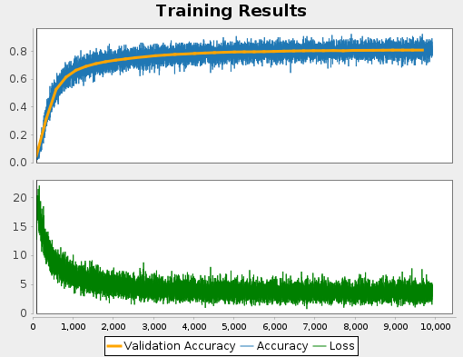
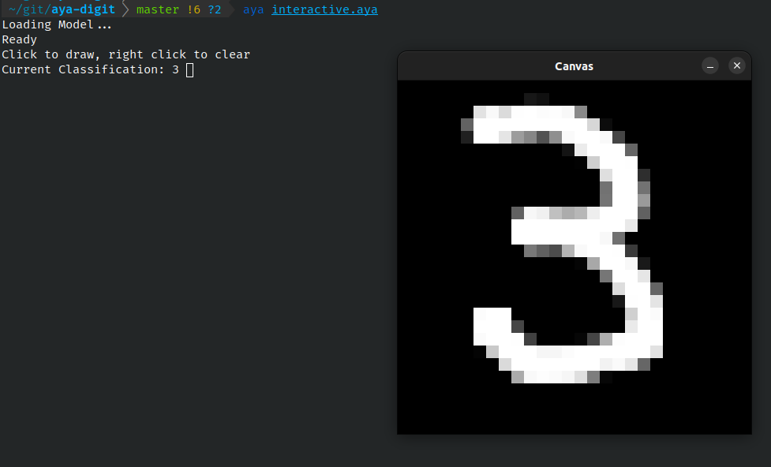

# Aya Digit Recognition with a Neural Network

An implementation of a simple neural network with one hidden layer that achieves 80% accuracy on the MNIST dataset.

  
*Accuracy, Validation Accuracy, and Loss for a 10,000 step training process*

## Scripts

### Interactive Demo

```
aya interactive.aya
```



This script loads the model `model.json` and runs a forward pass on the canvas to predict a result. Draw on the canvas with left click, clear the canvas with right click. The output in the console is updated automatically.  

**Limitations:** Since this implementation is a simple network with one hidden layer, performance on unseen data from the demo is very poor. It can generally detect 0s, 1s, 3s, and 4s pretty well. Other numbers are often misclassified as a 1. Switching to a convolutional network would improve performance significantly but I haven't taken the time to implement one yet.


### Training

```
aya train.aya
```

Loads the MNIST dataset and trains for 10,000 steps. The final model is saved as `model.json`. Training results are saved as `training.json` and can be used by `plot_results.aya` to generate the above plot.

Training code is based off [MNIST Handwritten Digits Classification From Scratch](https://towardsdatascience.com/mnist-handwritten-digits-classification-from-scratch-using-python-numpy-b08e401c4dab).


### View Results

```
aya plot_results.aya
```

Generates the plot above using data from `training.json`


## Other Files

  - **mnist_loader.aya:** Functions for loading MNIST's ubyte format
  - **mnist_preview:** Defines a single function which randomly samples images and labels and shows them on a canvas. Can be used to preview inputs to the neural network
  - **nn_functions.aya:** Defines functions used for training such as sigmoid and softmax
  - **model.json:** Sample pretrained model that achieves 80.91% on MNIST
  - **training.json:** Training progress data generated when training *model.json*


